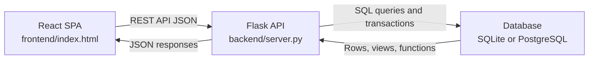
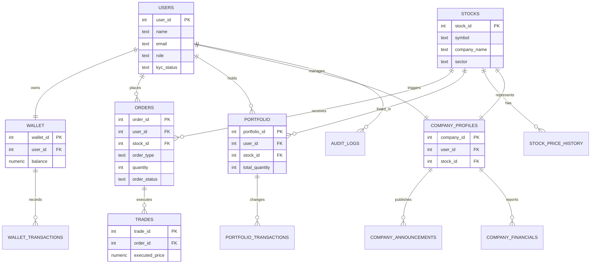

# TradeFlow Stock Trading System

TradeFlow is a DBMS project for a stock trading platform. It includes a React single-page frontend, a Python Flask API, and a relational database design for users, companies, admins, orders, trades, wallets, portfolios, audit logs, and stock price history.

## Features

- JWT login and protected API routes
- Role-based access for `USER`, `COMPANY`, and `ADMIN`
- Stock browsing with price history charts
- Buy and sell order flow with wallet and portfolio updates
- Wallet deposit, withdrawal, and transaction history
- Portfolio summary with invested value, current value, and profit/loss
- Company dashboard with announcements and financial results
- Admin panel for users, companies, stocks, wallets, orders, and audit logs
- SQLite local mode for quick testing
- PostgreSQL/Supabase mode for DBMS deployment

## Tech Stack

| Layer | Technology |
| --- | --- |
| Frontend | React from CDN, Chart.js, HTML, CSS, JavaScript |
| Backend | Python, Flask, Flask-CORS, PyJWT |
| Database | SQLite for local development, PostgreSQL/Supabase for deployment |
| DBMS Concepts | Tables, views, triggers, functions, indexes, constraints, transactions, role-based access |

## Architecture



## Database Diagram



For the detailed project explanation and a larger ER diagram, see [study/PROJECT_NOTES.md](study/PROJECT_NOTES.md).

## Project Structure

```text
tradeflow_v4_complete/
├── backend/                 # Flask API and local SQLite initializer
│   ├── middleware/          # JWT auth middleware
│   ├── routes/              # API route modules
│   ├── db.py                # PostgreSQL/SQLite database adapter
│   ├── init_db.py           # Local SQLite schema and seed data
│   ├── server.py            # Backend entry point
│   ├── requirements.txt     # Python dependencies
│   └── .env.example         # Example environment variables
├── frontend/
│   └── index.html           # React single-page application
├── database/
│   ├── schema.sql           # Main PostgreSQL/Supabase schema
│   ├── README.md            # Database setup notes
│   └── backup/
│       └── backup.tar       # Full PostgreSQL backup archive
├── study/
│   ├── PROJECT_NOTES.md     # Combined project explanation and diagrams
│   ├── diagrams/            # HTML diagram file
│   └── Tradeflow DBMS Final Project Report.pdf
├── .gitignore
└── README.md
```

## Getting Started

### 1. Clone the Repository

```bash
git clone https://github.com/Manthan2196/TradeFlow-Stock-Trading-System.git
cd TradeFlow-Stock-Trading-System
```

### 2. Set Up the Backend

```bash
cd backend
python -m venv .venv
.venv\Scripts\activate
pip install -r requirements.txt
copy .env.example .env
python server.py
```

The backend runs at:

```text
http://localhost:4000
```

Health check:

```text
http://localhost:4000/api/health
```

### 3. Open the Frontend

Open this file in your browser:

```text
frontend/index.html
```

The frontend expects the backend API at:

```text
http://localhost:4000/api
```

## Database Setup

### Local SQLite Mode

For local testing, leave `DATABASE_URL` empty in `backend/.env`. When the backend starts, `init_db.py` creates and seeds a local SQLite database automatically.

### PostgreSQL/Supabase Mode

To use Supabase or PostgreSQL:

1. Create a PostgreSQL/Supabase project.
2. Run `database/schema.sql` in your SQL editor.
3. Set `DATABASE_URL` in `backend/.env`.
4. Restart the backend.

The schema file combines the project schema, v4 company-role updates, dashboard fixes, and admin reporting views.

### Restore From Backup

The full database backup is stored at:

```text
database/backup/backup.tar
```

Use it only when you want to restore the complete PostgreSQL database dump, including data:

```bash
pg_restore --clean --if-exists --dbname "<your-postgres-connection-string>" database/backup/backup.tar
```

For normal setup, prefer `database/schema.sql` because it is cleaner and easier to review.

## Demo Credentials

| Role | Email | Password |
| --- | --- | --- |
| User | `demo@tradeflow.in` | `password` |
| Admin | `admin@tradeflow.in` | `password` |
| Company | `company@tradeflow.in` | `password` |

## Main API Routes

| Area | Routes |
| --- | --- |
| Auth | `/api/auth/*` |
| Stocks | `/api/stocks/*` |
| Orders | `/api/orders/*` |
| Portfolio | `/api/portfolio/*` |
| Wallet | `/api/wallet/*` |
| Admin | `/api/admin/*` |
| Company | `/api/company/*` |

## Study Material

The `study/` folder now keeps GitHub-facing material only:

- [PROJECT_NOTES.md](study/PROJECT_NOTES.md): combined project explanation, workflows, relationships, and diagrams
- [Tradeflow DBMS Final Project Report.pdf](study/Tradeflow%20DBMS%20Final%20Project%20Report.pdf): final report
- [Relational Diagram TradeFlow.html](study/diagrams/Relational%20Diagram%20TradeFlow.html): HTML ER diagram

## GitHub Notes

The repository ignores local-only files:

- `backend/.env`
- local SQLite database files such as `backend/tradeflow.db`
- Python cache folders such as `__pycache__/`
- virtual environments

## Project Summary

TradeFlow demonstrates how a trading application can be designed around strong database concepts. The backend exposes role-protected REST APIs, the frontend provides role-specific dashboards, and the database layer handles core entities such as users, wallets, orders, trades, portfolios, stock history, company data, and audit logs.
