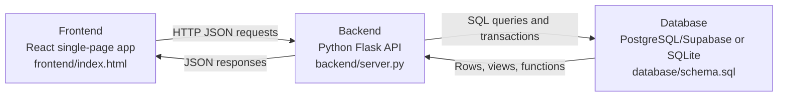
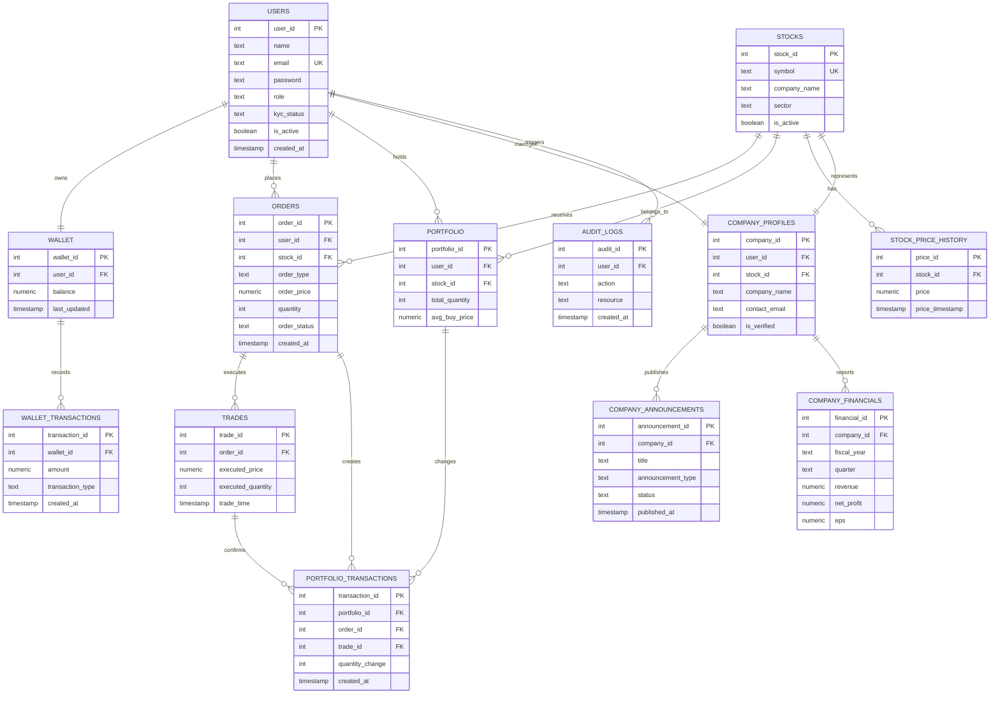
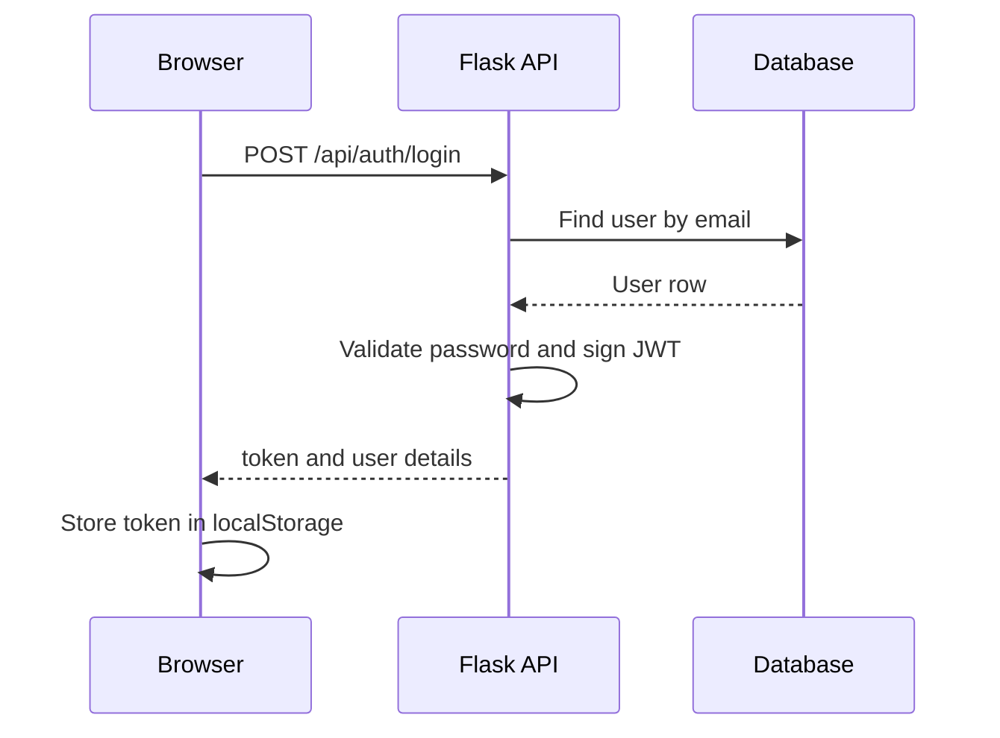
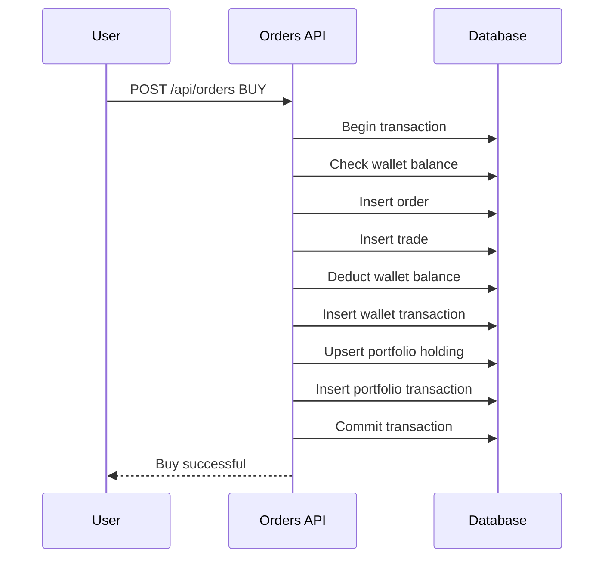

# TradeFlow Project Notes

These notes explain the TradeFlow DBMS project in one place for GitHub, viva preparation, and future maintenance.

## Project Overview

TradeFlow is a stock trading system with three user roles:

- `USER`: browses stocks, manages wallet balance, places buy/sell orders, and tracks portfolio performance.
- `COMPANY`: manages a listed company profile, reviews stock sentiment, publishes announcements, and adds financial results.
- `ADMIN`: manages platform users, companies, stocks, wallets, orders, audit logs, and reporting views.

The application has three layers:



## Main Modules

| Module | Main Files | Purpose |
| --- | --- | --- |
| Frontend | `frontend/index.html` | Single-page interface for users, companies, and admins |
| Backend entry | `backend/server.py` | Starts Flask, enables CORS, registers route blueprints, and runs the price simulator |
| Database adapter | `backend/db.py` | Uses PostgreSQL when `DATABASE_URL` exists, otherwise uses local SQLite |
| Local database seed | `backend/init_db.py` | Builds and seeds SQLite demo data for local runs |
| Auth middleware | `backend/middleware/auth.py` | Verifies JWT tokens and enforces role access |
| Routes | `backend/routes/*.py` | API endpoints grouped by feature |
| SQL schema | `database/schema.sql` | Main PostgreSQL schema, views, functions, triggers, indexes, and admin views |

## Entity Relationship Diagram

GitHub renders this Mermaid diagram directly:



An HTML version of the relational diagram is also available at `study/diagrams/Relational Diagram TradeFlow.html`.

## Important Relationships

| Relationship | Type | Explanation |
| --- | --- | --- |
| `users` to `wallet` | 1-to-1 | Each user owns one wallet; `wallet.user_id` is unique |
| `users` to `orders` | 1-to-many | One user can place many buy/sell orders |
| `stocks` to `orders` | 1-to-many | One stock can appear in many orders |
| `orders` to `trades` | 1-to-many | One order can create one or more execution records |
| `users` to `portfolio` | 1-to-many | One user can hold many stocks |
| `stocks` to `portfolio` | 1-to-many | One stock can be held by many users |
| `portfolio` to `portfolio_transactions` | 1-to-many | Every portfolio change is recorded |
| `stocks` to `stock_price_history` | 1-to-many | A stock has many historical price points |
| `users` to `company_profiles` | 1-to-1 | A company user manages one company profile |
| `company_profiles` to `company_announcements` | 1-to-many | A company can publish many announcements |
| `company_profiles` to `company_financials` | 1-to-many | A company can upload many quarterly/annual results |

## Core Workflow: Login



After login, each protected request includes:

```text
Authorization: Bearer <token>
```

The middleware decodes the token and stores the current user in Flask's request context.

## Core Workflow: Buy Order



The sell flow is similar, but it checks portfolio quantity first, credits the wallet, and reduces or removes the portfolio holding.

## Role-Based Access

| Role | Frontend Experience | Backend Access |
| --- | --- | --- |
| `USER` | Dashboard, market, portfolio, wallet, orders | Own wallet, portfolio, orders, stocks |
| `COMPANY` | Company dashboard, announcements, financials, profile | Own company profile and linked stock |
| `ADMIN` | Full admin panel | Platform-wide users, stocks, wallets, companies, orders, logs |

Role checks happen in `backend/middleware/auth.py` through decorators such as:

```python
@require_auth
@require_role("ADMIN")
```

## Database Concepts Used

### Constraints

- Primary keys uniquely identify rows.
- Foreign keys preserve relationships between tables.
- Unique constraints prevent duplicate emails, duplicate stock symbols, duplicate wallets, and duplicate company-stock mappings.
- Check constraints keep values valid, such as positive order quantities, valid roles, valid transaction types, and non-negative balances.
- Defaults simplify inserts, such as default role, status, timestamps, and wallet balance.

### Views

Views keep complex joins readable and reusable. Important examples include:

- `v_dashboard`: wallet balance, invested amount, portfolio value, and order counts for user dashboards.
- `v_portfolio_detail`: holding-level portfolio view with current value and unrealized profit/loss.
- `v_stock_latest_price`: latest market price for each stock.
- `v_company_stock_sentiment`: buy/sell sentiment for company dashboards.
- `view_admin_user_overview`, `view_admin_platform_stats`, and `view_admin_stock_overview`: admin reporting views.

### Transactions

Order placement updates several tables together. A buy order touches orders, trades, wallet, wallet transactions, portfolio, and portfolio transactions. These changes must commit together or roll back together so money and holdings never become inconsistent.

### Triggers and Auditability

Triggers are used to update timestamps, validate portfolio quantities, and write audit/system log records. This gives the system a history of important platform actions.

## API Summary

| Area | Example Routes |
| --- | --- |
| Auth | `POST /api/auth/login`, `GET /api/auth/me` |
| Stocks | `GET /api/stocks`, `GET /api/stocks/:id/history` |
| Orders | `GET /api/orders`, `POST /api/orders` |
| Portfolio | `GET /api/portfolio`, `GET /api/portfolio/summary` |
| Wallet | `GET /api/wallet`, `POST /api/wallet/deposit`, `POST /api/wallet/withdraw` |
| Company | `GET /api/company/profile`, `POST /api/company/announcements`, `POST /api/company/financials` |
| Admin | `GET /api/admin/users`, `GET /api/admin/companies`, `POST /api/admin/wallets/:user_id/adjust` |

## Demo Users

| Role | Email | Password |
| --- | --- | --- |
| User | `demo@tradeflow.in` | `password` |
| Admin | `admin@tradeflow.in` | `password` |
| Company | `company@tradeflow.in` | `password` |

## Quick Viva Points

- TradeFlow is a three-layer system: React frontend, Flask backend, relational database.
- The backend can use PostgreSQL/Supabase in production and SQLite for local demos.
- JWT is used for login sessions.
- Role-based middleware protects admin and company routes.
- Order placement is transaction-based to keep wallet, order, trade, and portfolio data consistent.
- Views simplify dashboard, portfolio, stock, company, and admin screens.
- Constraints and triggers enforce data correctness at the database level.
- The database design demonstrates relationships, normalization, indexes, views, triggers, and auditability.
